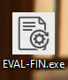
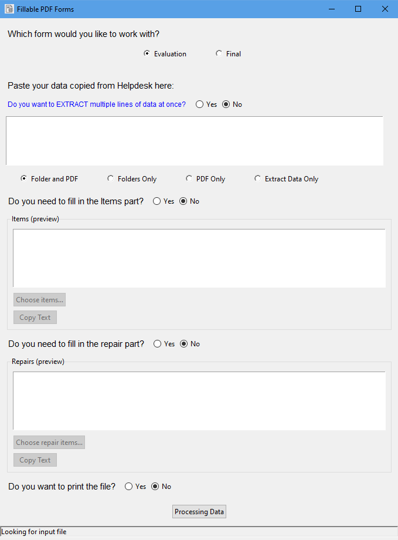
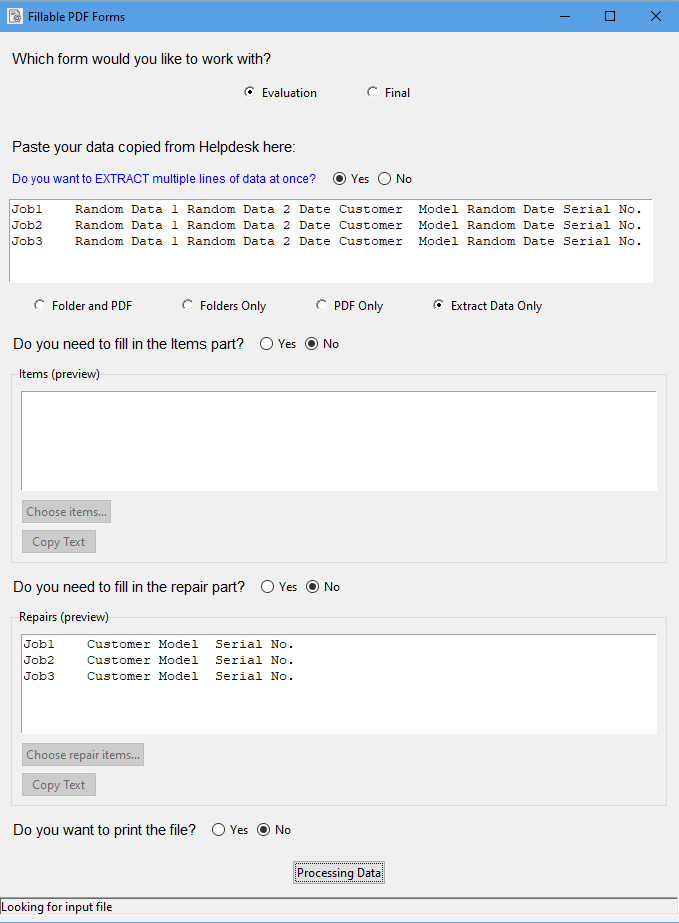
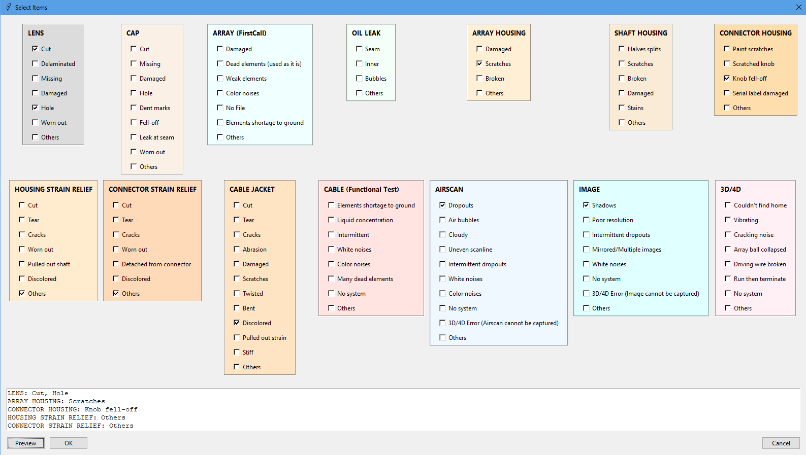
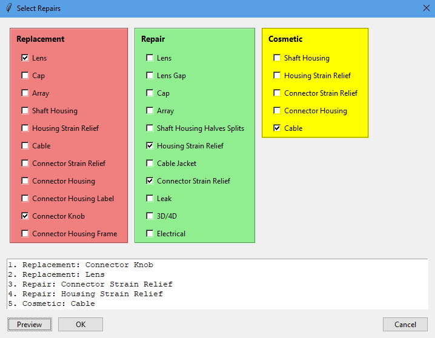
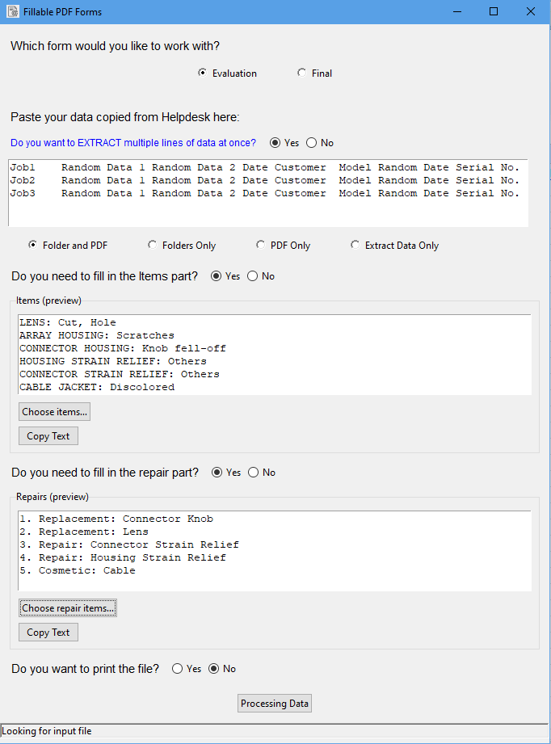
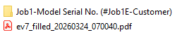
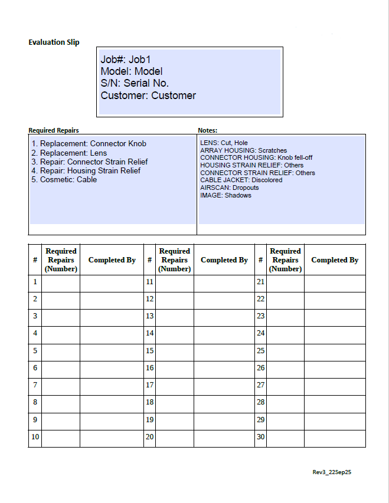
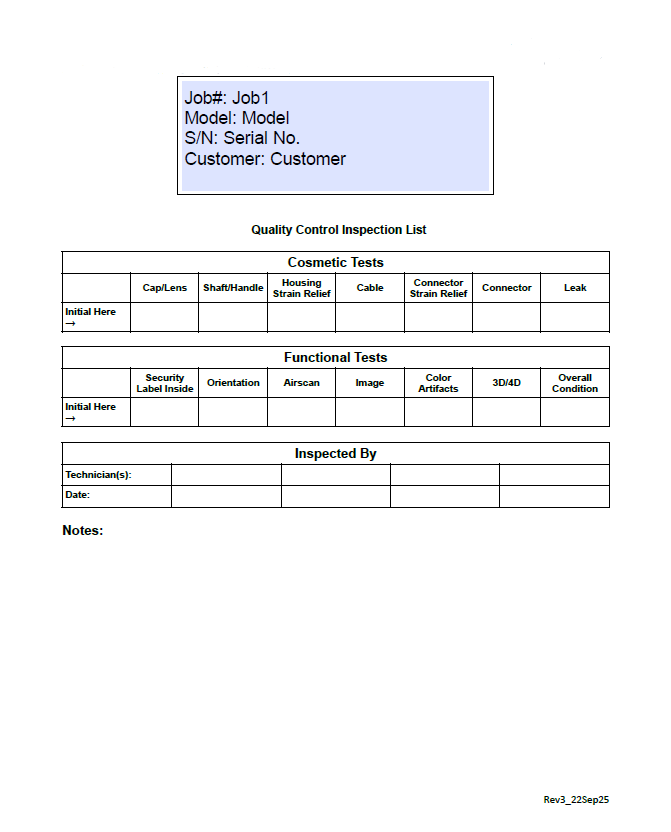

# Evaluation-Automation-Tool
A Python-based GUI that processes raw data (textbox), then automatically fills and generates fillable PDF documents with the processed results. Ideal for automating form generation, reporting, and document workflows.

The application allows users to:
<ul>
  <li> Paste Helpdesk job data</li>
  <li> Extract and format information </li>
  <li> Select repair items or inspection items </li>
  <li> Generate folders</li>
  <li> Fill PDF forms automatically</li>
  <li> Print the generated documents</li>
</ul>

<h4>Executable File</h4>

<h4>Launch App</h4>

<h4>Extractring Data</h4>

<h4>Popup Items</h4>

<h4>Popup Repairs</h4>

<h4>Processed popups</h4>

<h4>Generated products</h4>

<h4>Filled Evaluation PDF</h4>

<h4>Filled Final PDF</h4>

# Test Coverage
This project includes structured test coverage across:
<ul>
  <li>UI Test Cases</li> 
  <li>Backend Test Cases</li>
  <li>Regression Test Cases</li>
</ul>

See full test plan: [Test Plan](TEST_PLAN.md)

Test Case Dashboard

A web-based dashboard to visualize UI, Backend, and Regression test cases.

# Install dependencies
pip install -r requirements.txt

# Run the application
python main_eval_final.py
