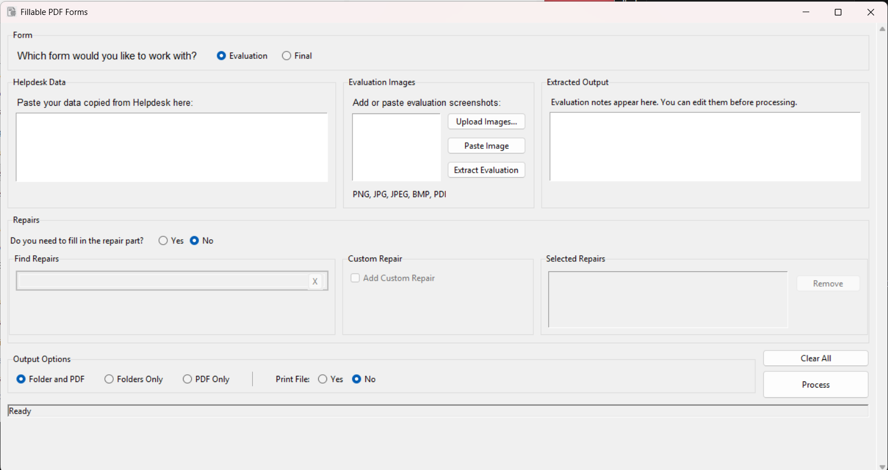
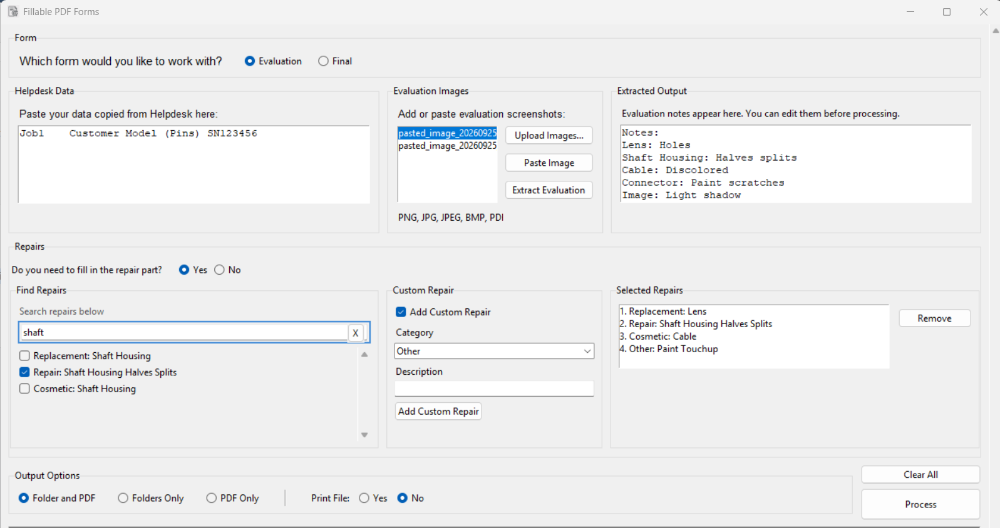
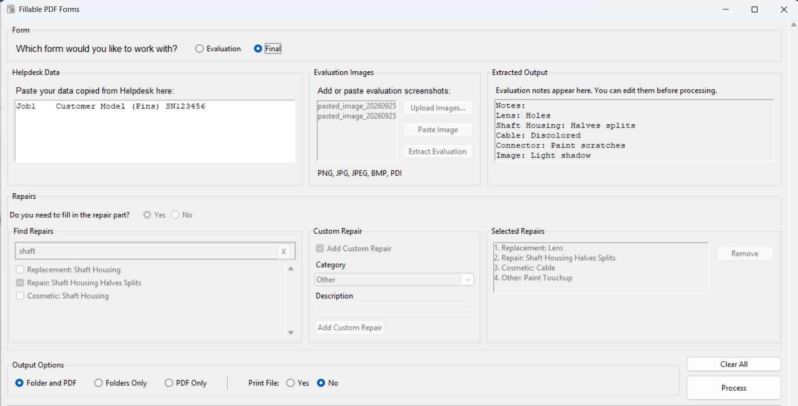
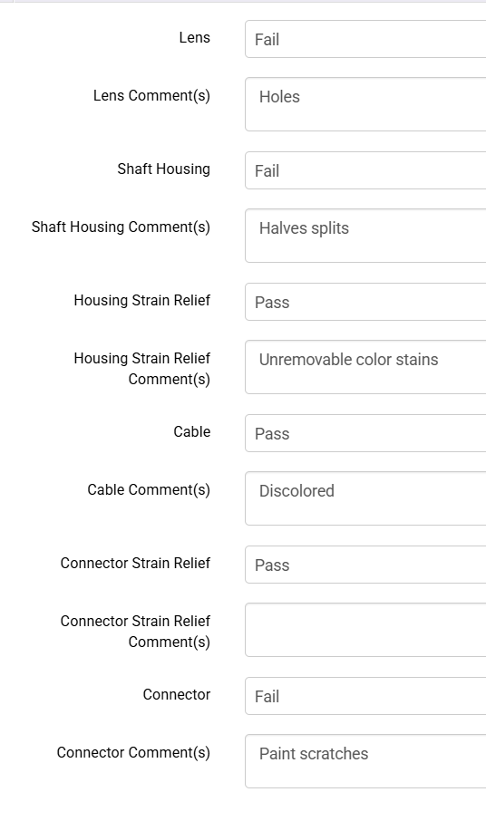
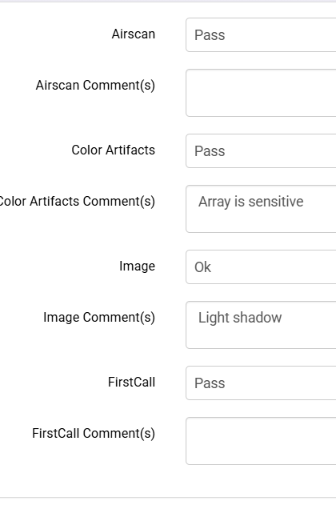
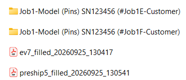
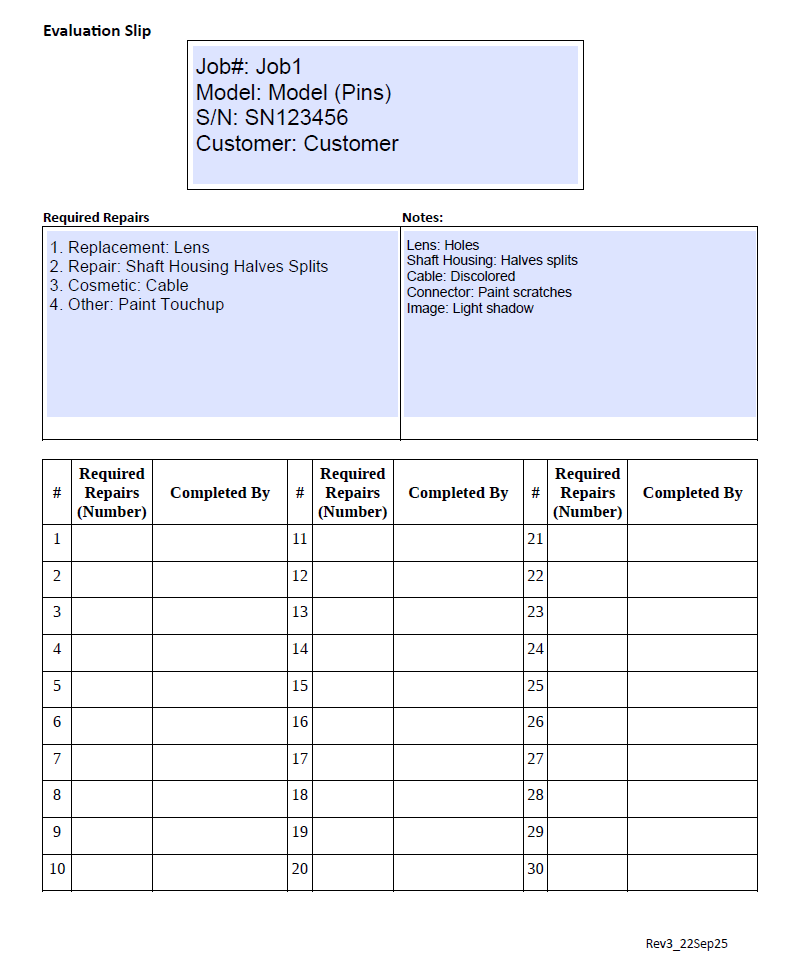
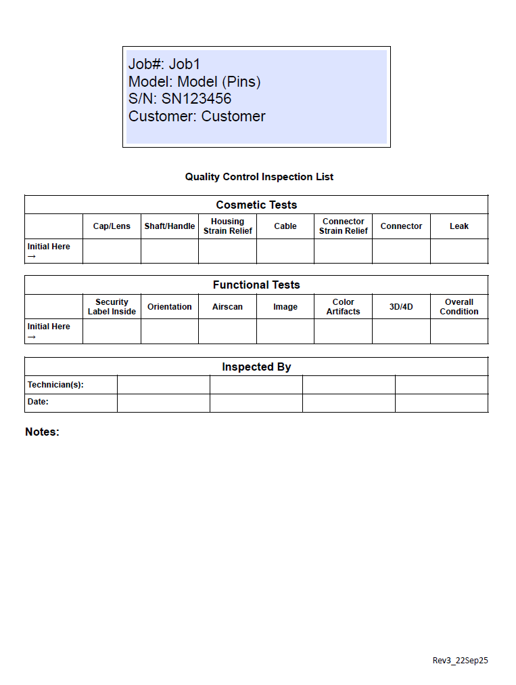
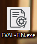

# Evaluation Automation Tool — Version 2

Version 2 of the **Evaluation Automation Tool** is a Python-based desktop GUI for processing Helpdesk job data, extracting evaluation notes from screenshots, selecting required repairs, creating job folders, and generating fillable PDF forms.

The Version 2 workflow is designed to reduce manual data entry and keep the Evaluation and Final form processes in one application.

## Version 2 Features

### Automatic Helpdesk Data Extraction

Paste Helpdesk job data directly into the **Helpdesk Data** area.

The application automatically extracts and formats:

- Job number
- Customer
- Model
- Serial number

If required information is missing or a pasted row is invalid, the application warns the user instead of silently processing incomplete data.

### Evaluation and Final Modes

The application supports two workflows:

- **Evaluation** — uses Helpdesk data, evaluation screenshots, extracted evaluation notes, and required repairs.
- **Final** — uses the Helpdesk data needed to create the final form.

### Evaluation Image Upload and Paste

Evaluation screenshots can be added in two ways:

- Upload an existing image or PDF.
- Copy a screenshot and paste it directly into the application.

Supported files:

- PNG
- JPG
- JPEG
- BMP
- PDF

The application uses OCR to read populated evaluation `Comment(s)` fields and places the extracted information into the **Extracted Output** area for review and editing.

### Evaluation Comment Extraction

The application can extract evaluation comments such as:

```text
Lens: Delaminated
Cable: Discolored
FirstCall: System error
3D/4D: System error
```

Multi-line comments are combined into one readable line.

### Repair Search

The **Find Repairs** section allows users to search the predefined repair list by keyword.

Matching repairs appear as selectable options. Selecting a repair immediately adds it to **Selected Repairs**.

Selected repairs are ordered by priority:

1. Replacement
2. Repair
3. Cosmetic
4. Other

Example:

```text
1. Replacement: Lens
2. Repair: Cable Jacket
3. Cosmetic: Cable
```

### Custom Repairs

If the required repair is not in the predefined repair list, enable **Add Custom Repair** and enter:

- Category
- Description

Custom repairs are added to the same Selected Repairs list and included in the generated Evaluation PDF.

### Folder and PDF Output

The application supports:

- **Folder and PDF** — create the job folder and generate the PDF.
- **Folders Only** — create folders for all valid Helpdesk rows.
- **PDF Only** — generate the PDF without creating a job folder.

The **Print File** option can also be enabled when a PDF is generated.

### Clear All

Use the main **Clear All** button to reset the current job and start fresh.

The **Process** button processes the current data without clearing the screen, allowing corrections and reprocessing if needed.

---

## Application Screenshots

### Main GUI



### Evaluation Mode



### Final Mode



### Evaluation Screenshot Examples





### Processed Results



### Filled Evaluation PDF



### Filled Final PDF



### Executable



---

## Install Dependencies

```bash
pip install -r requirements.txt
```

## Run the Application

```bash
python main_eval_final.py
```

## Build the Executable

### 1. Create a PyInstaller spec file

```bash
pyi-makespec --onefile --noconsole --icon=processing_v2.ico main_eval_final.py
```

### 2. Add the PDF templates and icon to the spec file

```python
datas=[
    ('ev7.pdf', '.'),
    ('preship5.pdf', '.'),
    ('processing_v2.ico', '.'),
    ('Tesseract-OCR', 'Tesseract-OCR')
]
```

Set the executable icon:

```python
exe = EXE(
    ...,
    icon='processing_v2.ico'
)
```

### 3. Build the executable

```bash
pyinstaller main_eval_final.spec
```

---

## Version

This README describes **Version 2** of the Evaluation Automation Tool.
